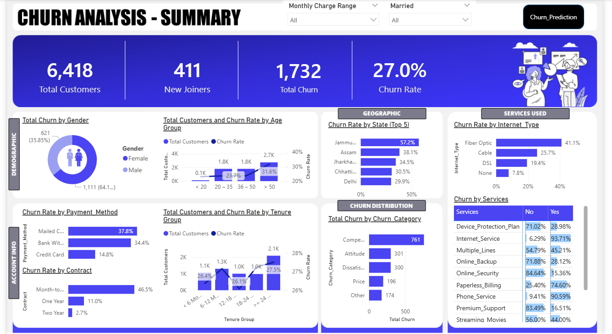

# customer-churn-analysis
Customer Churn Analysis using SQL, Power BI &amp; Machine Learning
# 📊 Customer Churn Analysis & Prediction

## 🔍 Project Overview

This project presents an end-to-end **Customer Churn Analysis and Prediction System** built using SQL Server, Power BI, and Machine Learning.

The objective is to analyze customer behavior, identify key churn drivers, and predict future churners to enable proactive business decisions.

---

## 🛠️ Tech Stack

* **SQL Server** – Data Extraction, Transformation, Loading (ETL)
* **Power BI** – Interactive Dashboard & Data Visualization
* **Python** – Machine Learning Model (Random Forest)
* **Libraries** – pandas, numpy, matplotlib, seaborn, scikit-learn

---

## ⚙️ Project Workflow

### 1️⃣ Data Engineering (SQL ETL)

* Loaded raw CSV data into staging table (`stg_Churn`)
* Performed data validation and null analysis
* Cleaned and transformed data using SQL
* Created production table (`prod_Churn`)
* Built views:

  * `vw_ChurnData` → Existing customers
  * `vw_JoinData` → New customers

---

### 2️⃣ Data Transformation (Power BI)

* Created calculated columns:

  * Churn Status (0/1)
  * Age Groups
  * Tenure Groups
  * Monthly Charge Buckets
* Built mapping tables for segmentation

---

### 3️⃣ Dashboard & Visualization

#### 📌 Summary Dashboard

* Total Customers: **6,418**
* New Joiners: **411**
* Total Churn: **1,732**
* Churn Rate: **27.0%**

**Insights:**

* High churn observed in **month-to-month contracts**
* Customers with **higher monthly charges** show increased churn
* Certain states and demographics contribute more to churn

---

#### 📌 Prediction Dashboard

* Predicted Churners: **378 customers**
* Displays:

  * Customer ID
  * Monthly Charges
  * Revenue Contribution
  * Referral Count

**Business Use Case:**

* Helps target high-risk customers with retention strategies

---

## 🤖 Machine Learning Model

* Algorithm Used: **Random Forest Classifier**
* Steps:

  * Data preprocessing & label encoding
  * Train-test split (80/20)
  * Model training and evaluation
* Evaluation Metrics:

  * Confusion Matrix
  * Classification Report
* Feature importance used to identify key churn drivers

---

## 📈 Key Insights

* Customers with **Month-to-Month contracts** have highest churn rate
* **Fiber optic users** show higher churn compared to other services
* Lack of **premium support and security services** increases churn risk
* Customers with **low tenure** are more likely to churn

---

## 📂 Project Structure

```
Customer-Churn-Analysis/
│
├── SQL/
├── PowerBI/
├── ML_Model/
├── images/
├── README.md
```

---

## 📸 Dashboard Preview

### 🔹 Summary Dashboard



### 🔹 Prediction Dashboard


---

## 🚀 Future Improvements

* Implement advanced models (XGBoost, LightGBM)
* Deploy model using Flask/FastAPI
* Automate ETL pipeline
* Integrate real-time data streaming

---

## 👩‍💻 Author

**Shreya Patil**
Aspiring Data Analyst | Power BI | SQL | Python

---
